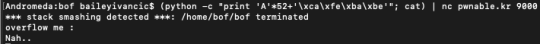

#**BOF**

*"Nana told me that buffer overflow is one of the most common software vulnerability. Is that true?"*

—————————————————————–

The third CTF I completed from pwnable.kr actually tied in very well to our lecture and tutorial content for the week. During the tutorial, Kristian went through buffer overflow attacks, how they work and where they originated from. We looked at one of the earliest articles written on buffer overflow attacks, an article from Phrack magazine titled "Smashing the stack for fun an profit". A link to the article is attached in the title. I plan on doing a read-through of this when I get a bit more time, as it does seem like a very interesting article and one that would link in really well to what we are doing. When (if) I do a read-through of the article, i will do a mini analysis/write-up on the blog and link it in this article.


Anyway, onto the CTF.


As hinted by the name "bof" and the description text, this CTF will require a buffer overflow attack for us to exploit and obtain the flag. There are a few files that we are required to download for this, namely bof and bof.c. Let's examine bof.c:


Helpfully, they have not been very vague as to where we need to perform our buffer overflow attack. The program is using gets, which means that even though the variable overflowme is 32 bytes, the size is never checked, meaning that more than 32 bytes can be read in. This is good news for us, but bad news for the program, since we will be exploiting this vulnerability to get access to the flag.

Looking again at the program, our goal is to get into the if statement allowing for the system call (since this will allow us to access the flag). The if statement we need to pass compares the int that is passed in to the key "0xcafebabe". If we can find a way to overflow the buffer and write over this value, then we will be able to set our own value for the comparison.


To perform the buffer overflow, I needed to know how much extra I needed to write so that i would be writing over the comparison. Firing up gdb, I started analysing the main function to see where the int was stored in memory. After a few disas commands, I got to the following:


Now at this point, I got a bit stuck. I knew that i was looking for the integer, but I didn't exactly know how to find it. After doing a bit of digging around on the internet, I discovered that the line I was looking for was actually the line that contained the comparison, since the integer follows directly onwards. After as bit more digging, I found the assembly command I was looking for was "cmpl", which appears just a bit before halfway on our assembler dump. We can also see this is the correct one, since it has the "$0xcafebabe" That we were expecting.

Again consulting the internet for help, I used a breakpoint set at the cmpl command to observe the memory at that point in time. The important thing to note here is that buffer overflow attacks must be a contiguous chunk of data, and so I needed to know how much to fill up before I was at the desired location.

Setting "(gdb) break *0x0000000100000ec3″, I then ran the program to see where the variable was being stored.  Using the line

```=> 0x0000000100000ec3 <+51>: cmpl   $0xcafebabe,-0x34(%rbp)```

From the assembly instructions, I looked at the memory address containing "deadbeef", and then compared that with the memory address containing "cafebabe". After (so much) messing around, googling and gdp-wrestling, I finally found the exact memory addresses of the deadbeef and cafebabe strings. Comparing the two addresses, I found that they were 52 bytes apart, so I would need to add 52 bytes of padding before my new password.

Sicne I want the last bit of the string to be "cafebabe", I need 52*bytes + "cafebabe". "Cafebabe" will be stored as \xca\xfe\xba\xbe in memory, so using Python to come up with the other bits, the command to give my buffer attack string will be:

python -c "print 'A'*52+'\xca\xfe\xba\xbe'"; cat;

And then piping that into the call to the server given to us in the instructions:

```(python -c "print 'A'*52+'\xca\xfe\xba\xbe'"; cat) | nc pwnable.kr 9000```


Hm.

(Little endian strikes back)

I should have remembered this from the last CTF I did. The ordering in little endian is swapped around. Therefore, the correct command should be:

```(python -c "print 'A'*52+'\xbe\xba\xfe\xca'";cat) | nc pwnable.kr 9000```


And thus, our flag:

---

*Flag: "daddy, I just pwned a buFFer :)"*