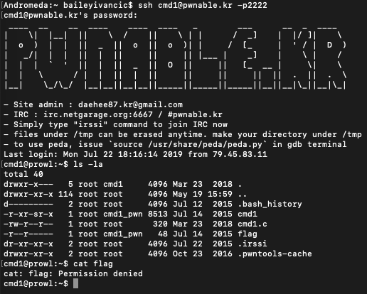
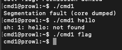
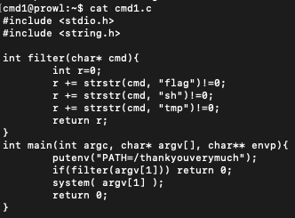
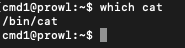
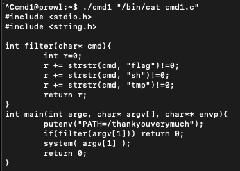
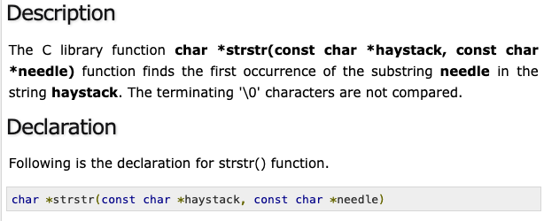
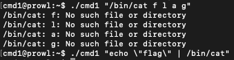
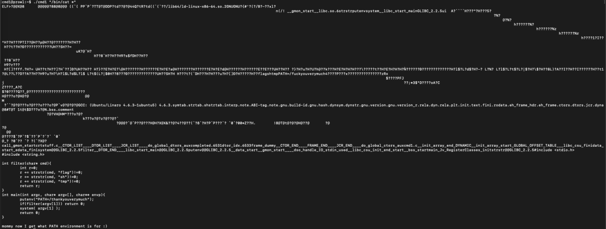

#**cmd1**

*"Mommy! what is PATH environment in Linux?"*

—————————————————

This CTF starts off the same as most of the others, SSH into the box, and then try to exploit something to get the flag from there.

Since we can't get to the flag on our own, we will need to exploit something in order to get the flag for us. Given the name of the CTF, this will likely be cmd1. Running ./cmd1 gives us some interesting behaviour:

We need to find out. more. Looking at the source code of cmd1, we see the following:

The program is essentially a wrapper for the system call, however it is doing some stuff to our input before the input is actually run. First, it is passed through a filter which looks for the words "flag", "sh" and "tmp". This will be a bit of a problem, since we need to be able to write flag into the input to get our flag out. The second problem is that it is changing the PATH variable using the putenv() command.

The second problem is easy to get around. All we need to do is give the program the full path of cat, and then it will be able to find it even though the variable is changed. To find the full path of cat, we can just run the which command which will show us exactly where it is stored.

Using this, let's test to see if this overcomes the second problem.

Cat is not behaving like we want it to, and was able to give us the contents of a file in the directory. However, running the same command with flag instead of cat.c gives us no output, because of the filter function.

I had to do a bit of research to find the solution to the first problem. The program uses strstr() to find an occurrence of flag in the input. From tutorialspoint.com:

A few more tries of some different techniques didn't yield any results either.

I tried looking for quite a while for a way to enter in flag into the input without it getting picked up by the filter function, but I couldn't find anything that worked on the system. One guide suggested splitting flag up into "f""l""a""g", but this didn't work either. Ashamedly, it took me this long to realise that the "*" character wasn't blacklisted, and I could actually just use this character to cat all the files in the current directory.

As expected, doing this gives us a load of rubbish from the binary files:

But at the end we get our flag! Solved!

---

*Flag: "mommy now I get what PATH environment is for :)"*

*22/7/2019*