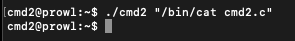

#**cmd2**

*Daddy bought me a system command shell.
but he put some filters to prevent me from playing with it without his permission…
but I wanna play anytime I want!*

—————————————————-

As with the previous CTF cmd1, we will need to ssh into the server to get access to the challenge. We actually have to use the flag of cmd1as the password to this CTF, so we can see that they are somehow linked.

Trying to cat the flag doesn't work (big surprise). The function seems to work the same way as the previous, in that it will let us run provide an input and it will then pass that input to a system call. However, there are a few interesting things with this one as opposed to the previous cmd1.

Firstly, the solution for the previous challenge now doesn't work (which should have been expected. This means that something inside the implementation has been changed. It seems that the PATH variable is still being changed, since I am unable to simply use cat by itself, but I am no longer able to specify the full path of the cat command either.

To see what is going on, we need to look at the source code:

We can now see what is causing the problem. Since the filter function has now been expanded, it is now looking for '/' characters, which we use when specifying the entire path for the cat command.

So we need to find a way to call cat, without specifying the entire path name. We also cannot re-set the PATH variable back to it's original state, since the '=' character is blacklisted as well.

Doing some research, I happened upon this site, which is about shell built-in commands. I didn't find too much information on here, but the command command seemed promising. I did a bit more digging, and then I found this page, which is an Ubuntu man page on shell built-in commands. Finding the section on the command command, we get the following description:

So essentially, command will find and run default system utilities when when the PATH variable does not point to them. This sounds like exactly what we need, time to test:

It works when using it on the standard terming, but that doesn't tell us much, since the PATH variable hasn't been changed here. Let's see if we can use it inside the cmd2 function.

It works! We give ./cmd2 the command -p cat command and it successfully finds cat for us and runs that as a system call. In the test, we are able to cat "cmd2.c" onto the terminal. Now, filter is still checking for any mentions of "flag" int he input. Since filter hasn't been told to look for any "*"s in the input, we are safe to use our trick from the last challenge to simply run cat on all the files in the directory, which will also include flag. Running the command:

There is our flag right at the bottom. Woo!

----

*Flag: "FuN_w1th_5h3ll_v4riabl3s_haha"*

*23/7/2019*