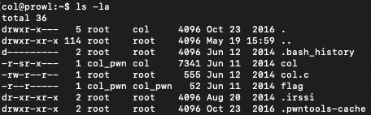
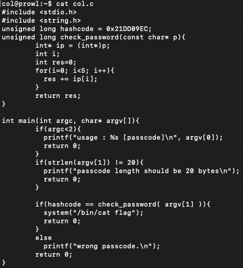
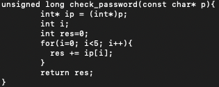
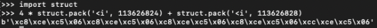
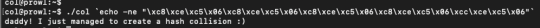

#**Collision**

*"Daddy told me about cool MD5 hash collision today.
I wanna do something like that too!"*


——————————-

This CTF starts off very similarly to the first CTF that I attempted. Upon clicking on the box, I am given a ssh command to follow, as well as the password into the machine.

Doing a quick ```ls -la``` on the root directory, I find the following:


As usual (and to no one's surprise) the flag file hidden by permissions, so we must find another way to get access. Oh hey ```col.c```, you look interesting!



So, there are a few interesting things in the file that we can see immediately. Firstly, our access point. To get access to the system call to cat flag, we must pass the if condition:

```if(hashcode == check_password( argv[1] ))```

Now, looking at hashcode, we find it is set to 0x21DD09EC, which is in hex notation. After a quick conversion to decimal, we get the number 568134124.


Looking at the second part of this command, check_password(), the implementation is specified above as:


A char pointer is passed into the function, which will be 20 bytes. The function then takes this string, and creates an integer (4 bytes) by reading the value in the pointer as 5 separate int pointers. As such, we need to find 4 integers that equal to the value of the hashcode (568134124).


It was at this part that I hit a roadblock. When looking for the integers to enter, I found that 4*113626824 and 113626828 would get us to the desired value. Since it needs to be read in as a character string, but then read as integers during the loop. However, since the character string needed to be 20 bytes, i wasn't sure how to exactly encode it so that it would be recognized correctly. After doing a little bit of research, i discovered that C stores integers in little-endian format. So to enter the integers intot he program, I first had to get them into the correct byte format. To do this, I used Python's struct.pack tool to do this.


Now, the output from this command will give us the character string that we need to pass into the program. Using ```echo``` with the ```-ne``` modifiers gives us the following:


Bingo! We now have the flag!

---

*Flag: "daddy! I just managed to create a hash collision :)"*