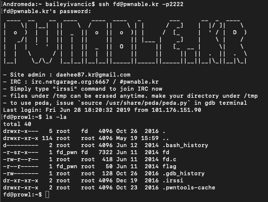
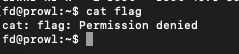
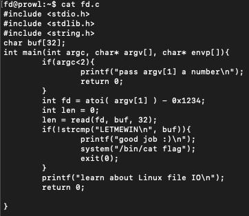
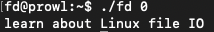
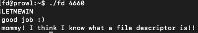

#**fd** 

*"Mommy! what is a file descriptor in Linux?"*

-----

Upon ssh'ing into the CTF environment and running ```la -la``` on the root directory, I was presented with this:


Awesome! flag is sitting there waiting for us to open it! Let me just run cat flag and…


Yeah. I could have guessed it wasn't going to be that easy.

Referencing back to the intro text, the file permissions on 'flag' didn't allow for read, write or executable access for Other entities (us right now). This meant that we were unable to cat the flag file to retrieve the flag. Chmodding the file to give us access won't work either, same issue.


So knowing we can't do anything to file in any way, we must find something we can use to give us permission into the file. Luckily (or conveniently), a file named fd.c exists within the same directory, which may be of use. Running cat on the contents of the file gives us the following:


Nestled right inside the if statement, is the line system("/bin/cat flag"). Something I didn't know before doing this CTF was that system calls within Linux run at elevated permissions, even when called by programs, which means this system call to cat the file flag will give us what we are looking for. So now, we need to find a way to get inside that if condition. The condition seems to be that we have the string LETMEWIN\n inside the variable buf, but the only thing modifying the buf variable is the read() call.


Time for a man search…

Looking at the man page for the read command, the description is the following:

*"read() attempts to read up to count bytes from file descriptor fd into the buffer starting at buf"*

So how can this help us? Something I had learnt long ago but since forgotten, a quick search for linux file descriptors online showed me that '0′ was the file descriptor for standard input. If we can get fd==0, then the program will start reading from stdin. Perfect!


Shifting the focus, I then started looking at the line ```"int fd = atoi( argv[1] ) - 0x1234;"```. The last element of the statement is clearly hexadecimal, so with a quick hex-to-decimal search I found that 0x1234 was in fact equal to 4660 in decimal.


And with that, we are ready to hack.

Running fd.c with any integer results in the expected output (of nothing):


However, when we enter in the magic number '4660′, the program starts reading in from stdin, and we are able to type in a string below. Using the phrase 'LETMEWIN" gives the following:


---

*Flag: mommy! I think I know what a file descriptor is!!*