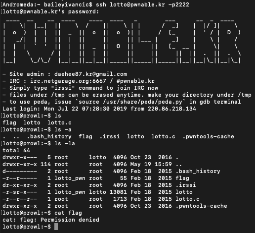
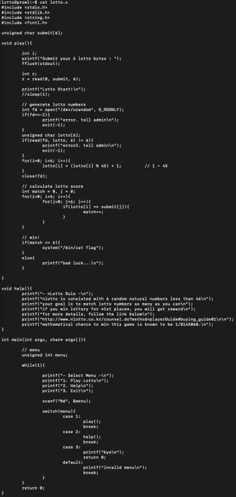
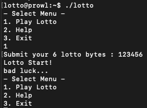
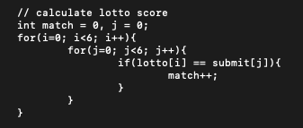
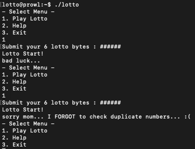

#**lotto**

*Mommy! I made a lotto program for my homework. do you want to play?*

————————————————-

Similar to the last CTF, we are given a brief and a ssh command to log into the vulnerable machine.

Standard stuff.

So now knowing we have to actually break into it, let's have a look at the source code.

Running the program, we can see it gets 6 values from somewhere, and then uses this as the code for the lotto game.

Now looking through the code, we can notice a key thing the programmer has missed that will make this CTF significantly easier to crack. The problem is specifically in this section here:

When the program calculates the lotto score, it actually compares every character in the input stream with every character in the random stream. Therefore, if we were to enter a string which was six duplicates and the program had one of these numbers in the random stream, the score would add to six and we would be awarded the flag.

For the duplicate values, I chose to use # (since the input is read in as a character stream, and # is 35 in ASCII - which is within the range we want). So then, running the program and using "######" as input:

We can see that it worked the second time.

For me, this felt a bit like cheating, because i felt like I hadn't "broken" or "hacked" anything. The important thing to realise here, however, is that the probability of success is now much, much lower knowing this error in the code. The program tells us that the probability of winning would be 1/8145060, but knowing our duplicate exploit, we can calculate the probability to be realistically 1/45 (since there are only 45 possible numbers, and we only need one number in the random buffer to be the number we choose). Comparing 1/45 to 1/8145060, that is a huge difference in security.

(In terms of bits of security, that is 2^6 vs 2^23. That is a reduction of 17 bits of security!)

---

*Flag: "sorry mom… I FORGOT to check duplicate numbers… :("*