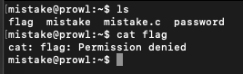
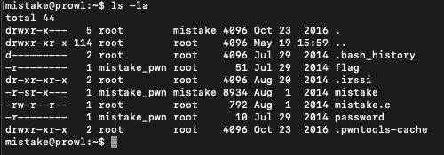
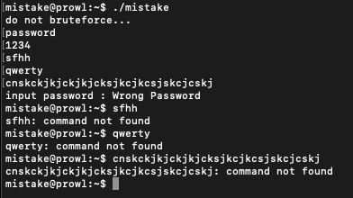
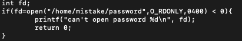
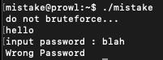
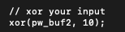
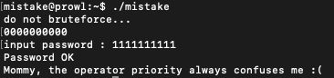

#**mistake**

*We all make mistakes, let's move on.
(don't take this too seriously, no fancy hacking skill is required at all)*

This task is based on real event
Thanks to dhmonkey

*hint : operator priority*

————————————————-

As with many of the other CTFs, this one is hosted on the pwnable server, and we need to ssh into it to start the challenge.

Always worth a try.

We see in the directory that we have three files of interest, two binary files (password and mistake) and then the course code mistake.c.

Before looking at the source code, let's try running the program to see if we can get any clues.

Running the program actually gives us some very interesting behaviour. Once run, the program waits for a password to be entered in, and seems to wait until the correct password is given, since it will continue waiting on standard input. The interesting thing is that inputting in a very long password seems to cause something to break down internally, and exit the program with errors.

Looking at the source code now, we can see what the probably route of attack will be. Given the hint about operator priority, we can guess that the problem has something to do with the following block of code:

After doing a bit of refreshing of my own knowledge of operator priorities, I found that the '<' will be evaluated before the '=' operator. Thus, the comparison open(..) < 0 will be evaluated first, and will return a 0, which means that fd will be equal to 0. From one of the earlier CTFs I completed, I remembered that 0 is the file descriptor for stdin.

What this means for the program, is that the program is actually reading the password from stdin, instead of the password file. This can be confirmed while running the program:

What should be happening is that it should immediately request the user's password and say "input password", however we are actually able to enter our own string and make this the password. This is likely why a very long password broke the program before, since a check was made for the length of the password.

This piece of information is also crucial for telling us what the password and input should be for the program. We can see from the xor function above that pw_buf2 is xor'ed with XORKEY, which is set to 1 at the start of the program. Thus, our input when xor'ed with 1 must equal the password we give the program. Further, these strings have to 10 characters long, since that is what PW_LEN is set to initially. The easiest combination is '0000000000′ and '1111111111′. Let's give it a try.

And we're in! Flag obtained.

---

*Flag: "Mommy, the operator priority always confuses me :("*