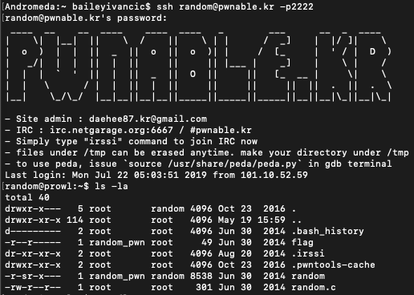
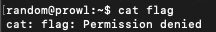
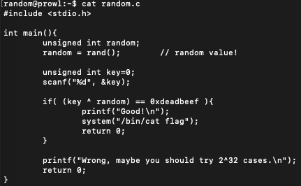
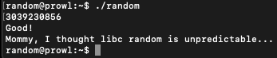

#**random**

*Daddy, teach me how to use random value in programming!*

———————————————–

The fifth CTF I completed was called "random". As the name and intro text imply, this involved using random numbers to try and find a vulnerability within the system. At the start of the CTF, we are given an ssh prompt, meaning this CTF is going to involve getting the flag from inside the vulnerable machine. Upon ssh'ing into the machine and running an ls, we have the following in our directory:

One quick little check:

Always worth a try.

So let's have a closer look at random.c.

So to get the flag, we need to make our (key ^ random) value == 0xdeadbeef. This will then evaluate the if statement to true, and then let us run the system call to cat our flag.

I became a little bit stuck at this point. How do you determine the key if it uses a random function inside it? After doing a bit of reading and digging on the rand() function in C, I realised that the way they had implemented it was flawed and had created a vulnerability. Since rand() is not called with a seed, it will use the default seed value of 1. The numbers that rand generates are predictable and follow a formula, and as such knowing the seed allows us to know what number will be outputted by the call. However, the call to rand will be platform specific, so we need to run rand in the same way it is run in the program to determine what number we will get.

Running the rand function on the specific machine gives us a value of 1804289383. As we previously saw from the function, we need (key ^ random) = 0xdeadbeef. Since we know the value of random already, and 0xdeadbeef is a constant, we simply need to use log laws to rearrange the equation to find out our key. This rearranged equation becomes key = random ^ 0xdeadbeef.

By putting this into the python calculator, we get key = 3039230856.

Since the only argument given to the program is the key, this should be all we need! Running the program with the given key:

And we're in! Success!

---

*Flag: "Mommy, I thought libc random is unpredictable…"*